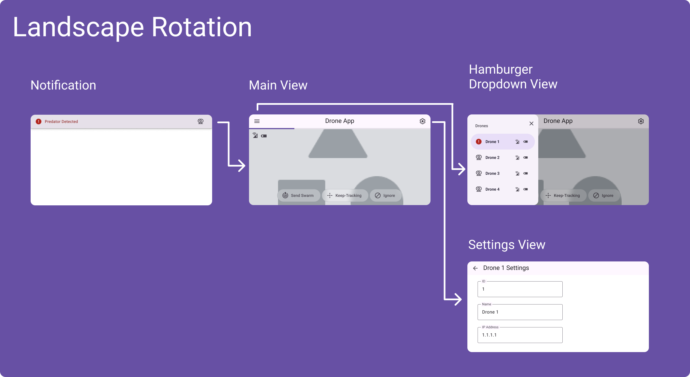
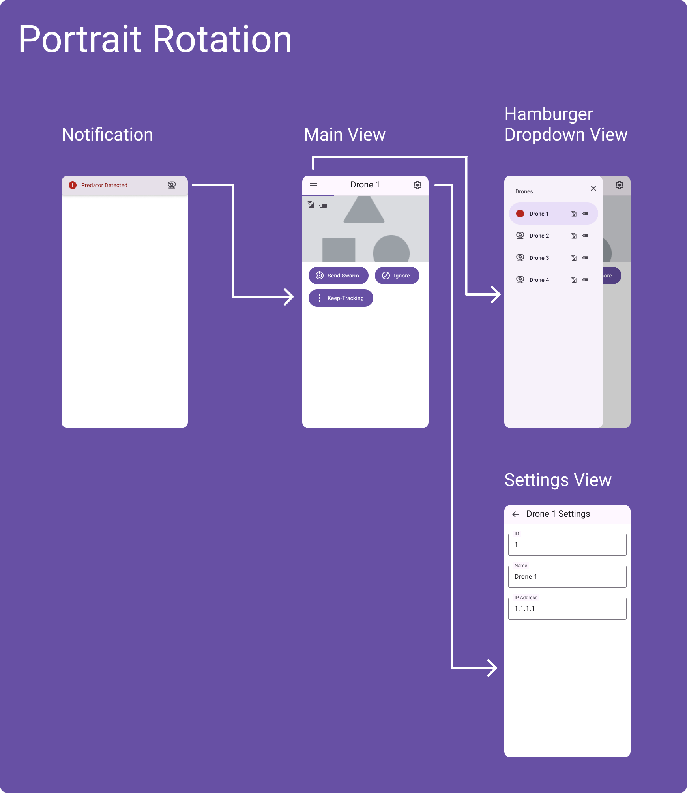

# **Diploma Drone Project**
### *Advanced Programming Assesment 2023*
<br>

An application that shows the use of;
- Python API BackEnd
- React FrontEnd
- Tello drone control & communication
- Video object tracking

## **Description**

This application has been created to show a modern, responsive web user interface, incorporating video display, basic machine vision functions, and a scalable design that can manage a drone.

ChatGPT has been used throught all code creation and the prompts / chat can be found in: `chatgpt-prompts.md`

## **Design**


<a href="https://www.figma.com/proto/WVJMK4lT14X71zeyFLAhX5/Drone-Swarm-App?type=design&node-id=54195-34799&scaling=min-zoom&page-id=54195%3A34798&starting-point-node-id=54195%3A34807&show-proto-sidebar=1">Figma Prototype
</a>

## **Storyboarding**

### Scene 1: Threat Identified by Drone
1. User receives threat notification.
2. User clicks/presses notification button.
3. The application then opens to the drone that has identified the threat showing a video feed and a option to either "Keep-Tracking", "Swarm" or "Ignore".
4. User selects option and drone(s) act accordingly.

### Scene 2: User Views Drone Video Feeds
1. User opens application.
2. When application first opens user .is shown the first drone in the list's video feed.
3. User selects menu button and selects another drone.
4. Selected drones details and video feed is updated onto the screen.

## **Installation**

1. Navigate to the backend directory:
```bash
cd diploma-project-drone-swarm/BackEnd
```
2. Install backend dependencies:
```bash
pip install -r requirements.txt
```
1. Navigate to the frontend directory:
```bash
cd diploma-project-drone-swarm/FrontEnd`
```
6. Install frontend dependencies:
```bash
npm install
```

## **Usage**

1. Open a new terminal window and navigate to the backend directory:
```bash
cd diploma-project-drone-swarm/BackEnd`
```
2. Start backend server:
```bash
python main.py
```
3. Open a new terminal window and navigate to the backend directory:
```bash
cd diploma-project-drone-swarm/FrontEnd`
```
4. Start frontend server:
```bash
npm start
```
5. If a web browser doesn't automatically open, open your web browser and go to: http://localhost:3000

## **Contact**
Name: Jourdan Tears <br>
TafeID: 20088599 <br>
Email: 20088599@tafe.wa.edu.au
